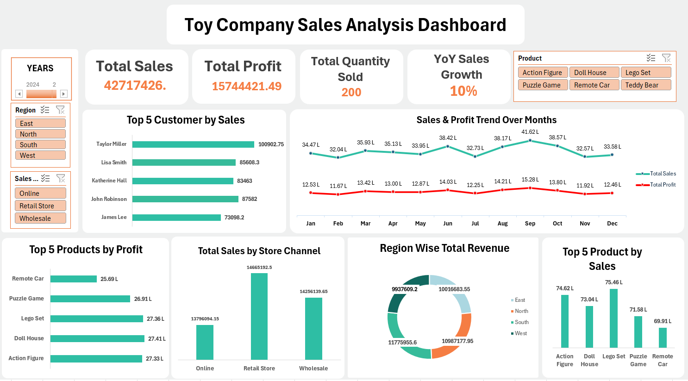

# 🎯 Toy Company Sales Analysis Dashboard

Welcome to my Excel-based sales analysis project for a fictional Toy Company!  
This dashboard provides actionable insights into sales, profit, customer trends, product performance, and more — all built using Microsoft Excel.

---

## 📌 Project Objective

- Analyze sales performance over multiple years
- Identify top-performing products, regions, and sales channels
- Understand customer behavior and profitability
- Track Year-over-Year (YoY) growth and key KPIs
- Create an interactive dashboard for storytelling with data

---

## 📊 Key Metrics & Results

| Metric                | Value        |
|-----------------------|--------------|
| Total Sales           | ₹4.27 Cr     |
| Total Profit          | ₹1.57 Cr     |
| Quantity Sold         | 200 units    |
| YoY Sales Growth      | 10% (2024 vs 2023) |
| Best-Selling Product  | Lego Set (₹75.46 L) |
| Most Profitable Item  | Doll House   |
| Top Customer          | Taylor Miller |
| Top Channel           | Retail Store |
| Leading Region        | South India  |

---

## 🧠 Tools & Skills Used

- **Microsoft Excel**
  - Pivot Tables & Pivot Charts
  - KPI Cards
  - Timeline Slicers & Filters
  - Custom Number Formatting (Lakh/Cr)
- **Power Query**
  - Data Cleaning & Transformation
- **Analytical Thinking**
  - KPI Design
  - YoY Comparison
  - Customer & Product Segmentation

---

## 📎 Files Included

- `Toy_Company_Dataset.csv` — Raw dataset used
- `Toy_Company_Dashboard.xlsx` — Final dashboard with interactive visuals
- `Beautiful_Toy_Sales_Dashboard_Presentation.pptx` — Slide deck summarizing the project
- `README.md` — Project documentation (you’re here!)

---

## 📷 Dashboard Preview

> _Tip: Replace the path above with a real screenshot or GIF of your dashboard._

---

## 🚀 How to Use

1. Download the `.xlsx` file
2. Open in Microsoft Excel (preferably 2019 or later)
3. Use slicers to explore by year, region, product, and sales channel
4. See live updates in KPIs and charts!

---

## 💬 Feedback

Feel free to suggest improvements, ask questions, or fork the project for your own use.  
Connect with me on [LinkedIn](https://www.linkedin.com/in/rishabhkumar12345/) — I'd love to hear your thoughts!

---

## 📘 License

This project is open-source and free to use for learning and educational purposes.
